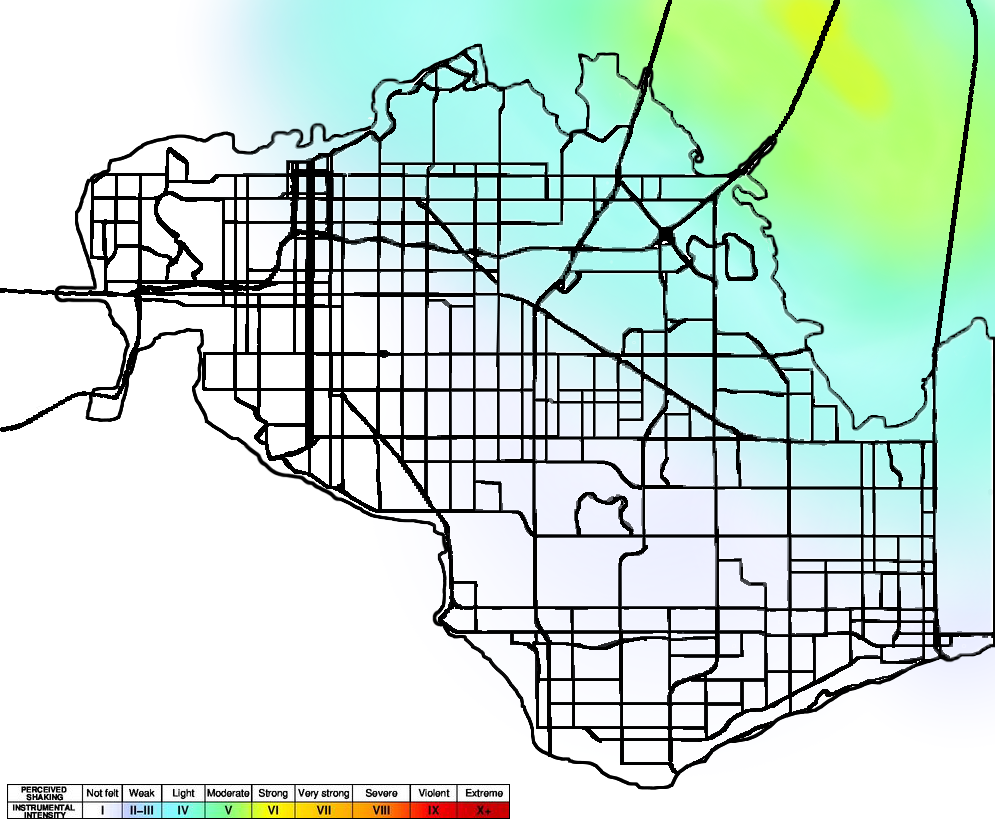

```{r setup, include=FALSE}
knitr::opts_chunk$set(
  echo = TRUE,
  warning = FALSE
)
```

```{r packages, message=FALSE}
library(tidyverse)
library(readxl)
library(janitor)
library(here)
library(lubridate)
library(plotly)
library(mosaic)
library(datapasta)
library(patchwork)
library(stringr)
library(readr)
library(data.table)
library(vroom)
library(readtext)
library(textrank)
library(tidytext)
library(tidyr)
```

```{r load-data, message=FALSE}
social_media <- read_csv("~/Downloads/DC5-Data/Y*Int Social Media Data/YInt.csv")
static_sensor_locations <- read_csv("~/Downloads/DC5-Data/Sensor Data and Maps/StaticSensorLocations.csv")
static_sensor_readings <- read_csv("~/Downloads/DC5-Data/Sensor Data and Maps/StaticSensorReadings.csv")
mobile_sensor_readings <- read_csv("~/Downloads/DC5-Data/Sensor Data and Maps/MobileSensorReadings.csv")
mc1_reports_data <- read_csv("~/Downloads/DC5-Data/Damage Reports/mc1-reports-data.csv")
```


## Generate a master timeline of events and trends during the emergency response. Pay particular attention to places where the timing of events is uncertain, and note which data underlies that uncertainty.

## Emergency responders will base their initial response on the earthquake shake map, but their response may change based on damage reports from citizens on the ground. How would you prioritize neighborhoods for response?

```{r}
# change data to long format for heat map
mc1_reports_data_long <- reshape2::melt(mc1_reports_data, id.vars = c("time", "location"))

# handling missing and repeated data
heat_map_data <- mc1_reports_data_long %>%
  group_by(time, location, variable) %>%
  mutate(value = round(mean(value, na.rm = TRUE), 2)) %>%
  unique()

# by location
shake_data <- heat_map_data %>% 
  filter(variable == "shake_intensity")

ggplot(shake_data, aes(time, location)) +
  geom_tile(aes(fill = value)) +
  scale_fill_gradient(low = "blue", high = "red") +
  labs(
    title = "Shake Intensity Over Time by Location",
    x = "Time", y = "Location", fill = " Value"
  ) +
  theme_minimal() +
  theme(axis.text.x = element_text(angle = 90, vjust = 0.5, hjust = 1))
```

Based on the chart above of the shake intensity reported over time in the 19 St. Himark locations, the most red locations (indicative of higher damage) should receive help first. Locations 4, 7, 12, and 18 should receive aid,

## Compare the reliability of neighborhood reports. Which neighborhoods are providing reliable reports? Provide a rationale for your response.

```{r}
# by location
ggplot(heat_map_data, aes(time, variable)) +
  geom_tile(aes(fill = value)) +
  facet_wrap(~location) +
  scale_fill_gradient(low = "blue", high = "red") +
  labs(title = "Report Variables Over Time by Location", x = "Time", y = "Report Variable", fill = " Value") +
  theme_minimal() +
  theme(axis.text.x = element_text(angle = 90, vjust = 0.5, hjust = 1))
```

In this plot above, we see the reports of all 19 locations over the 5 day period. It is apparent that some locations have less reliable reporting. For example, location 4, 7, 10, and 17 have sparse maps indicating that there was missing data. 

Similarly, we can see that locations 2, 6, and 15 have the most regular and reliable reporting.

In making this plot, we realized that there was missing and corrupt report data in many locations. We dealt with this by: 

- **missing data:** we dropped the values
- **corrupt data:** we defined this as the repeated values for the same location and variable at the same time. We took the average of the multiple reports of the same reading.

Additionally, to get a sense of the reported damage for each neighborhood, we calculated the average value of damage (on a scale of 1 - 10) per neighborhood for each of six categories: Sewer and Water damage, Power damage, Road and Bridge damage, Medical damage, Building damage, and Shake Intensity. We then compared these values with the shake map from April 8th. 



Looking at the shake map, it appears that locations 3, 4, 7, and 12 would have experienced the brunt of the quake. Locations 1, 5, 6, and 9 would be some of the least affected.

```{r}
#looking at MC1 reports
#grouping by location
#calculating average of each variable (average across 4/6-4/11)

mc1_averages <- aggregate(mc1_reports_data[, 2:7], list(mc1_reports_data$location), mean, na.rm = TRUE)
```

```{r}
#visualize the averages for each category across locations

#sewer and water plot
p1 <- plot_ly(
  x = mc1_averages$Group.1,
  y = mc1_averages$sewer_and_water,
  name = "Sewer and Water",
  type = "bar")
#power plot
p2 <- plot_ly(
  x = mc1_averages$Group.1,
  y = mc1_averages$power,
  name = "Power",
  type = "bar") 
#roads and bridges plot
p3 <- plot_ly(
  x = mc1_averages$Group.1,
  y = mc1_averages$roads_and_bridges,
  name = "Roads and Bridges",
  type = "bar")
#medical plot
p4 <- plot_ly(
  x = mc1_averages$Group.1,
  y = mc1_averages$medical,
  name = "Medical",
  type = "bar") 
#buildings plot
p5 <- plot_ly(
  x = mc1_averages$Group.1,
  y = mc1_averages$buildings,
  name = "Buildings",
  type = "bar") 
#shake intensity plot
p6 <- plot_ly(
  x = mc1_averages$Group.1,
  y = mc1_averages$shake_intensity,
  name = "Shake Intensity",
  type = "bar") %>% 
  layout(title = "Citizen-Reported Damage by Neighborhood")
```

```{r}
subplot(p1, p2, p3, p4, p5, p6, nrows=2)
```

It seems like 3 is a pretty reliable neighborhood, as it experienced the brunt of the quake and was consistently in the top averages for each damage category. 7 and 8 were also up there a lot, which makes sense as they were also in range of the shake map. However, 4 and 12 were two of the neighborhoods who felt the quake most strongly but consistently reported lower damages. Additionally, 9 was in the top numbers a lot but was one of the locations that would have been least affected. Thus, it would appear that 3, 7, and 8 were some of the most reliable reporters, while 4, 12, and 9 were some of the least reliable. 

## Compare radiation measurements over time from both static and mobile sensors to identify areas where elevated radiation is detected. How does this change over time? How should the risk of radiation damage be mitigated?

### Static Sensor Data

We first wanted to map the static sensor locations onto the map of the neighborhoods.

```{r}
#scaling map to coordinates and plotting locations of static sensors
fig1 <- static_sensor_locations %>%
  plot_ly(
    x = ~Long,
    y = ~Lat,
    type = "scatter",
    mode = "markers",
    text = ~`Sensor-id`
  ) %>%
  layout(
    title = "Locations of Static Sensors",
    images = list(
      source = "https://raw.githubusercontent.com/mariumtapal/sds235-dc5/master/StHimarkLabeledMap.png",
      xref = "x",
      yref = "y",
      x = -120,
      y = 0.2385,
      sizex = 0.2883,
      sizey = 0.2385,
      sizing = "stretch",
      opacity = 1,
      layer = "below"
    )
  )

fig1
```

As you can see, not every neighborhood is represented by a static sensor, and Safe Town (neighborhood 4) has three sensors, but we still wanted to look at the average levels of radiation recorded at each sensor.

```{r}
#wrangling static sensor readings to get averages for each sensor across the five days (4/6 - 4/10) and creating new variable to correspond to location in mc1 reports, then joining by location

static_averages <- static_sensor_readings %>% 
  mutate(Group.1 = if_else(`Sensor-id` == 1, 1, 
                           if_else(`Sensor-id` == 4, 6,
                                   if_else(`Sensor-id` == 6, 5,
                                           if_else(`Sensor-id` == 9, 3,
                                                   if_else(`Sensor-id` == 11, 9,
                                                           if_else(`Sensor-id` == 14, 13, 4))))))) %>%
  group_by(Group.1) %>% 
  summarize(average = mean(Value)) %>% 
  right_join(mc1_averages, by = 'Group.1')
```


```{r}
#visualize averages of static sensor data by location
fig2 <- plot_ly(
  x = static_averages$Group.1,
  y = static_averages$average,
  type = "bar") %>% 
  layout(title = "Average Radiation Levels of Static Sensors by Neighborhood")

fig2
```

The neighborhood with the highest average radiation over the course of the five days, according to the static sensor data, is neighborhood 3 at 17.103 cpm, followed by neighborhood 4 at 16.245 cpm and neighborhood 9 at 15.835 cpm. However, because the static sensors are only located in neighborhoods 1, 3, 4, 5, 6, 9, and 13, this doesn't give us a full picture of the radiation at every neighborhood. It does make sense that neighborhoods 3 and 4 were most affected though, as they have pretty close proximity to the nuclear power plant.

To learn more about how radiation levels changed over time, we looked at the cumulative sensor readings for each day from April 6th to April 10th.

```{r}
#join static sensor locations with static sensor readings
static_sensors <- static_sensor_readings %>% 
  inner_join(static_sensor_locations, by = 'Sensor-id') %>%
  mutate(sensor_id = as.character(`Sensor-id`)) %>% 
  mutate(year = lubridate::year(Timestamp), 
                month = lubridate::month(Timestamp), 
                day = lubridate::day(Timestamp)) 
```

```{r}
#ggplot of sensors

fig4 <- ggplot(data = static_sensors, mapping = aes(x = day, y = Value, color = sensor_id)) +
  geom_line()+
  facet_wrap(~sensor_id)

ggplotly(p = fig4)
```

Sensor 1 had the highest recorded radiation on April 9th. Sensor 11 had the highest recorded radiation on April 6th. Sensor 12, located in Safe Town (where the nuclear plant is), had the highest recorded radiation on April 9th. Sensor 13, also located in Safe Town, had the highest recorded radiation on April 7th, but levels were relatively even from the 7th through the 10th. Sensor 14 had highest levels on April 8th. Sensor 15, the sensor closest to the nuclear plant, had highest levels on April 8th. Sensor 4 had highest radiation on April 10th. Sensor 6 had highest levels on April 10th, though this was still comparatively low. Finally, Sensor 9 had the highest levels on April 9th, but they were also very high on the 7th. 

Sensors 11, 13, 14, 15, and 9 all had peaks on the earlier side (between the 6th and the 8th) compared to the others. This makes sense because all of these sensors are in closer proximity to the plant, and therefore would be exposed to radiation earlier on. It therefore feels reasonable to assume the quake happened some time on April 8th. Sensor 11 is a little strange, though, because it is farther from the plant than 13, 14, 15, and 9 but had very high levels on the 6th and 7th, then very low levels on the 8th.

### Mobile Sensor Data

Because there were so many data points for the mobile sensor readings, we condensed them to only include every 24 rows, which would roughly be a reading ever two minutes instead of every five seconds. Then we randomly chose a sensor number to look at, number 10. By looking at the shake maps and the graph of the static sensors, we decided April 8th would be a good day to look at radiation activity.

```{r}
#looking at mobile sensor data
#picking random number of sensor to look at
set.seed(35)
sample (c(1:50), size=1)

#make new mobile sensor data set that only includes rows every 2 minutes
mobile_condensed = mobile_sensor_readings[seq(1, nrow(mobile_sensor_readings), 24), ]

#filter new dataset to just include #10 and April 8th
mobile_condensed %>% 
  filter(`Sensor-id` == 10) %>% 
  filter(Timestamp >= '2020-04-08 00:00:00' & Timestamp < '2020-04-09 00:00:00') %>% 
  mutate(Timestamp = as.character(Timestamp)) %>% 
  plot_ly(
    x = ~Long,
    y = ~Lat,
    type = "scatter",
    mode = "markers",
    text = ~`Value`,
    size = ~Value,
    colors = 'black',
    frame = ~Timestamp
  ) %>%
  layout(
    title = "Mobile Sensor 10 Readings on April 8th",
    images = list(
      source = "https://raw.githubusercontent.com/mariumtapal/sds235-dc5/master/StHimarkLabeledMap.png",
      xref = "x",
      yref = "y",
      x = -120,
      y = 0.2385,
      sizex = 0.2883,
      sizey = 0.2385,
      sizing = "stretch",
      opacity = 1,
      layer = "below"
    )
  )
```

At 16:40 on April 8th, the sensor readings start to increase dramatically, going from 21 cpu to 300 five minutes later to over 1000 shortly after 17:00. It continues to hover around 1300 cpu until about 20:53, when it starts to drop. It continues to drop until 21:57, when this sensor finally moves. This whole time it has been on the edge of Old Town and Safe Town, pretty close to where the nuclear plant is. It would make sense, then, that the earthquake happened around or slightly before 16:40 on the 8th.

## Characterize conditions across the city, and recommend how resources should be allocated at 5 hours and 30 hours after the earthquake. Include evidence from the data to support these recommendations. Consider how to allocate resources such as road crews, sewer repair crews, power, and rescue teams.

```{r}
time_data <- heat_map_data %>% 
  filter(time >= "2020-04-08 09:35:00" & time <= "2020-04-08 10:35:00")

ggplot(time_data, aes(time, location)) +
  geom_tile(aes(fill = value)) +
  facet_wrap(~variable) +
  scale_fill_gradient(low = "blue", high = "red") +
  labs(
    title = "Location Over Time by Report Variables",
    x = "Time", y = "Location", fill = " Value"
  ) +
  theme_minimal() +
  theme(axis.text.x = element_text(angle = 90, vjust = 0.5, hjust = 1))
```

We guess that the major quake happened around 8:35 am on April 8th. 5 hours and 30 minutes later is approximately 2:05 pm on the same day. The above plot shows the reporting from 2:05 pm $\pm$ 30 minutes. 

According to this chart, and excluding the missing data, it looks like power is the most affected, followed by roads and bridges, sewer and water and buildings. Therefore, the most resources should be allocated to power and the rest to road crews, rescue teams and sewer repair crews!

## Identify any times when conditions change in a way that warrants a re-allocation of city resources. What were the conditions before and after the inflection point? What locations were affected? Which resources are involved?

- pre shock
- major quake
- after shock

## Take the "pulse"" of the community. How has the earthquake affected life in St. Himark? What is the community experiencing?

Based on preliminary analysis of community sentiment, it seems like people are shaken by the earthquake and are skeptical about the function and safety of the nuclear power plant.  

```{r bigram analysis}
# finding all bigrams with stop words
bigrams <- social_media %>%
  unnest_tokens(bigram, message, token = "ngrams", n = 2)

# separating bigrams into two columns
bigrams_separated <- bigrams %>%
  separate(bigram, c("word1", "word2"), sep = " ")

# filters out stop words in bigrams
bigrams_filtered <- bigrams_separated %>%
   filter(!word1 %in% stop_words$word) %>%
   filter(!word2 %in% stop_words$word)

# common bigrams without stop words
bigrams_united <- bigrams_filtered %>%
  unite(bigram, word1, word2, sep = " ") %>%
  count(bigram, sort = TRUE) %>%
  slice(1:20) %>%
  filter(rank(desc(n))>0)

# could use date and location as input variables for shiny
freq_bi_plot <-ggplot(data = bigrams_united, aes(x = reorder(bigram, n), y = n)) +
  geom_bar(stat = "identity") + 
  coord_flip() +
  labs(title = "Bigrams That Appeared Most Frequently in Posts ", x = "Bigram", y = "Number of Occurances Accross All Posts") 
freq_bi_plot
```

With further analysis, it appears that the words "nuclear" and "nuclear power" most frequently appeared in posts made from the Downtown, Weston and Palace Hills areas.  These locations differ from location analysis of all posts (including ones that don't have the word "nuclear" in them) in that Palace Hills was the seventh most frequently posted location instead of third.  

```{r locations where nuclear appeared most frequently}
nuclear <- social_media %>%
  filter(str_detect(message, "nuclear power"))
nuclear

freq_location_n <- nuclear %>%
  group_by(location) %>%
  count(location, sort = TRUE)

# could use date as input variable for shiny
freq_location_plot_n <-ggplot(data = freq_location_n, aes(x = reorder(location, n), y = n)) +
  geom_bar(stat = "identity") + 
  coord_flip() +
  labs(title = "Locations Where Posts Including the Word \'nuclear\' \nWere Most Frequently Shared", x = "Location", y = "Number of Posts per Location") 
freq_location_plot_n
```

Another important detail we noticed is that there were a number of posts discussing hesitancy around the effectiveness of nuclear power plants and nuclear energy production.  A common sentiment among social media users was that people must protect themselves from nuclear power and that it would be difficult to afford the consequences of nuclear power.  Many users also thought that nuclear power was too expensive to be worth it.  Though, there were a small handful of users who noted that the power plant provided the community with "nice, quiet, safe jobs".  There was also a group of retired engineers and physicists who believed in the promise of nuclear power and hoped to dispel social media myths and fears surrounding nuclear power.  They went head to head with users like DerekNolan, a user with the highest number of posts, who believes the nuclear reactor company is trying to take over. 

As a final note, our team found it important to filter out advertisements from the social media data set.  Much of the advertisements were posted by accounts called Syndicated and used phrases like "shaking deals" or "this deal will leave you quaking".  These ads made it difficult to perform text analysis on events surrounding the earthquake, but the advertisements were ultimately filtered out.  

## Are there instances where a pattern emerges in one set of data before it presents itself in another? Could one data stream be used to predict events in the others? Provide examples you identify.

## The data in this challenge can be analyzed either as a static collection or as a dynamic stream of data, as it would occur in a real emergency. Can you find a way to bring your analysis online to fuse multiple data streams together as events are unfolding?

In this challenge we analyzed data as a static collection. However, in a real emergency, a dynamic stream of data would be useful. As data continuously flows in, some tools like a dashboard, could be helpful in flagging respective authorities if particular things need attention. For example, in our analysis above, we indicate that after the major quake almost all the report variables have an increased rating. Power and medical resources need attention so the system would alert the power companies and hospitals!
